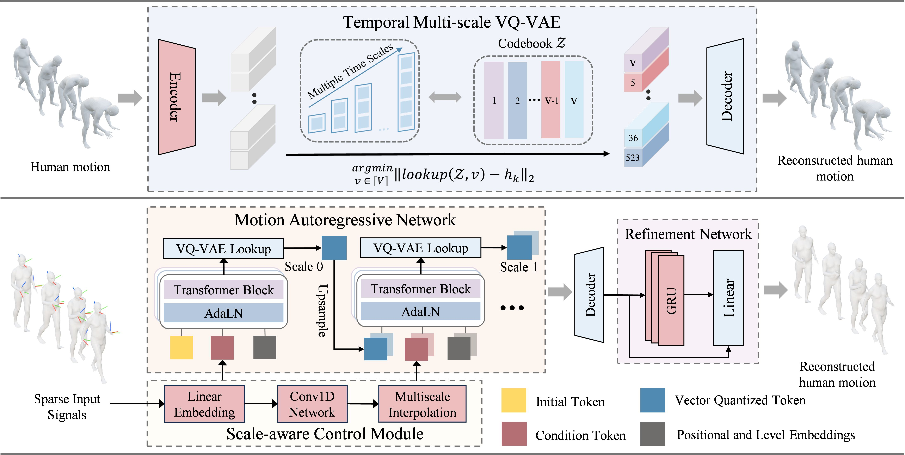

# MotionMAR: Multi-scale Auto-Regressive Human Motion Reconstruction from Sparse Observations

This is the official implementation of our ICML 2026 paper.

[[Paper](https://arxiv.org/abs/2606.23000)] [[Project Page](http://www.lidarhumanmotion.net/motionmar/)]

<p align="center">
  
</p>

## Environment

Create the environment by running the following instructions:

```bash
git clone https://github.com/Flipped111/MotionMAR.git
cd MotionMAR

# create a conda environment named MAR
conda create -n MAR python=3.9 pip=24.0 -y

# activate the environment
conda activate MAR

# install PyTorch. You can modify the PyTorch or CUDA version depending on your system.
python -m pip install torch==2.1.2 torchvision==0.16.2 --extra-index-url https://download.pytorch.org/whl/cu121

# install other Python libraries
python -m pip install -r requirements.txt
```

## Requirements

The Environment section above installs Python, PyTorch, and the packages listed in `requirements.txt`. In addition, download a `human_body_prior` source version compatible with Python 3.9 and PyTorch 2.1 from [the official repository](https://github.com/nghorbani/human_body_prior), and place `human_body_prior/` at the repository root.

## Dataset

Please download the datasets from [AMASS](https://amass.is.tue.mpg.de/index.html). The following subsets are required: `ACCAD`, `BMLmovi`, `BMLrub`, `CMU`, `EKUT`, `EyesJapanDataset`, `HDM05`, `HumanEva`, `KIT`, `MoSh`, `PosePrior`, `SFU`, `TotalCapture`, `Transitions` (only `SMPL+H G` is needed).

Download the required body models and place them under `./VQVAE/body_models/` of this repository. For the SMPL+H body model, download it from [MANO](http://mano.is.tue.mpg.de/) — please download the AMASS version of the model with DMPL blendshapes. You can obtain dynamic shape blendshapes, e.g. DMPLs, from [SMPL](http://smpl.is.tue.mpg.de). Registration is required for all of [SMPL](https://smpl.is.tue.mpg.de/index.html), [SMPL-X](https://smpl-x.is.tue.mpg.de/index.html), and [AMASS](https://amass.is.tue.mpg.de/index.html), and you must agree to their respective LICENSE. These model files are not included in this repository.

The required body model directory should look like this:

```text
VQVAE/body_models/
|-- smplh/
|   `-- male/
|       `-- model.npz
`-- dmpls/
    `-- male/
        `-- model.npz
```

Preprocess the data for S1 and S2, which share the same split:

```bash
python -m VQVAE.prepare_data \
  --root_dir /path/to/AMASS \
  --cfg VQVAE/config_vqvae/vqvae_S1.yaml
```

Preprocess the S3 data using the SAGE split:

```bash
python -m VQVAE.prepare_data \
  --root_dir /path/to/AMASS \
  --cfg VQVAE/config_vqvae/vqvae_S3.yaml
```

The AMASS-relative `.npz` paths under `./VQVAE/prepare_data/data_split/` include the [SAGE](https://github.com/Wenchao-M/SAGE) split for S3 and are mapped to `.pt` files during preprocessing.

## Pretrained Weights

Pretrained weights are provided for three settings: [S1](https://drive.google.com/file/d/172K5s_Ruk_Iw5TY-y3YnUcr8SV3ESPo6/view?usp=drive_link), [S2](https://drive.google.com/file/d/1_Dq4bvfQeKF6HGmKSzIkB-BPmCH2sIV4/view?usp=drive_link), and [S3](https://drive.google.com/file/d/14frx5fCxrG11Kp_EareHWrN3qyKr0pai/view?usp=drive_link). Unzip the weights into the `outputs/` directory. It should look like this:

```text
outputs/
|-- S1/
|   |-- vqvae/
|   |   `-- best.pth.tar
|   |-- var/
|   |   `-- best.pth.tar
|   `-- refiner/
|       `-- best.pth.tar
|-- S2/
|   |-- vqvae/
|   |   `-- best.pth.tar
|   |-- var/
|   |   `-- best.pth.tar
|   `-- refiner/
|       `-- best.pth.tar
`-- S3/
    |-- vqvae/
    |   `-- best.pth.tar
    |-- var/
    |   `-- best.pth.tar
    `-- refiner/
        `-- best.pth.tar
```

S1 is the default setting. Always use the configuration and checkpoints from the same setting.

## Training and Evaluation

Run all commands from the repository root.

The commands below use S1. To use S2 or S3, replace `_S1.yaml` in each `--cfg` path with `_S2.yaml` or `_S3.yaml`.

By default, the S1 checkpoints are expected at `outputs/S1/vqvae/best.pth.tar`, `outputs/S1/var/best.pth.tar`, and `outputs/S1/refiner/best.pth.tar`. Checkpoint paths can be changed in the corresponding configuration files.

### VQVAE

Train S1:

```bash
CUDA_VISIBLE_DEVICES=0 python -m VQVAE.train_vqvae --cfg VQVAE/config_vqvae/vqvae_S1.yaml
```

Test S1:

```bash
CUDA_VISIBLE_DEVICES=0 python -m VQVAE.test_vqvae --cfg VQVAE/config_vqvae/vqvae_S1.yaml
```

### VAR

Train VAR:

```bash
CUDA_VISIBLE_DEVICES=0 torchrun --nproc_per_node=1 --master_port=10094 train.py --depth=8 --bs=512 --ep=500 --fp16=1 --alng=1e-3 --wpe=0.1
```

Test S1:

```bash
CUDA_VISIBLE_DEVICES=0 python test.py --cfg VQVAE/config_vqvae/vqvae_S1.yaml
```

### Refiner

Train S1:

```bash
CUDA_VISIBLE_DEVICES=0 python train_refiner.py --cfg VQVAE/config_vqvae/refiner_S1.yaml
```

Test S1:

```bash
CUDA_VISIBLE_DEVICES=0 python test_refiner.py --cfg VQVAE/config_vqvae/refiner_S1.yaml
```

## Citation

If you find this work useful, please cite:

```bibtex
@inproceedings{luo2026motionmar,
  title={MotionMAR: Multi-scale Auto-Regressive Human Motion Reconstruction from Sparse Observations},
  author={Luo, Yuhua and Zhang, Junsheng and Liu, Mengyin and Lin, Xincheng and Yan, Ming and Chen, Zhudi and Wen, Chenglu and Xu, Lan and Shen, Siqi and Wang, Cheng},
  booktitle={Proceedings of the 43rd International Conference on Machine Learning},
  year={2026}
}
```

## Acknowledgements

This project builds upon open-source work from [human_body_prior](https://github.com/nghorbani/human_body_prior), [SAGE](https://github.com/Wenchao-M/SAGE), [VAR](https://github.com/FoundationVision/VAR), and [AvatarPoser](https://github.com/eth-siplab/AvatarPoser). We thank the authors for making their code available.

Third-party components retain their original copyright and license notices and remain subject to their respective licenses.

## License

Except where otherwise noted, this project is licensed under the [CC BY-NC-SA 4.0 License](LICENSE) for non-commercial use.
